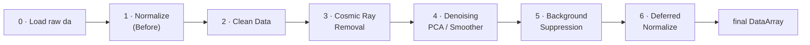

# SpectraLab — Data Flow & Operations Map

Where your data travels after upload, every operation it passes through, and exactly what is
cached vs. held in session state.

> **One invariant to remember:** `SpectralDataset.da` stays **raw forever**. Every stage returns a
> new `xr.DataArray` — never mutates its input — which is also why the session-level finals memo
> (below) can safely hand out shared object references instead of copies. `get_finals` checks that
> memo first (keyed on `file_hash + params_digest + keep_stages`); on a miss it falls through to the
> per-stage `st.cache_data` caches keyed on `(file_hash, recipe-so-far)` — so the raw parse, each
> processed stage, the assembled per-file result, and the on-screen chart are all separate cache
> layers, and a downstream param tweak (e.g. the bg scale) never recomputes upstream CRR/denoise
> results.

| Metric | Count |
|---|---|
| Workflow pages | 5 |
| Cache functions | 10 |
| Session-state keys | 12 |
| Pipeline stages | 7 |

---

## Interactive data-flow roadmap

```mermaid
flowchart LR
    upload([".wdf upload<br/><i>Sidebar file_uploader</i>"]):::source
    loadcache["_load_wdf_cached<br/><i>@st.cache_data</i>"]:::cache
    loadwdf["load_wdf()<br/><i>WDF parse → container</i>"]:::process
    dataset["SpectralDataset<br/><i>Typed xarray container</i>"]:::data
    sl_loaded[["sl_loaded<br/><i>session dict</i>"]]:::session
    data_page["Data Page + optics<br/><i>Sample structure / TMM</i>"]:::page
    sl_sample[["sl_sample_structure<br/><i>per-file optics</i>"]]:::session
    memo[["_sl_finals_memo<br/><i>session dict, zero-copy</i>"]]:::session
    getfinals["get_finals / per-stage caches<br/><i>@st.cache_data × 2 stages</i>"]:::cache
    preprocess["stage_* functions<br/><i>staged pipeline</i>"]:::process
    finals["per-file xr.Dataset<br/><i>final_da(all_datasets[fname])</i>"]:::data
    map["Map Analysis<br/><i>spatial heatmap</i>"]:::page
    nmf["Decomposition (NMF)<br/><i>Decomposer + diagnostic</i>"]:::page
    sl_nmf[["sl_nmf_result<br/><i>NMF components</i>"]]:::session
    deconv["Deconvolution<br/><i>PeakFitter (Gaussian)</i>"]:::page
    exports([Downloads<br/><i>NPZ / CSV buffers</i>]):::output

    upload --> loadcache --> loadwdf --> dataset --> sl_loaded
    sl_loaded --> data_page --> sl_sample
    sl_loaded --> memo
    sl_sample --> memo
    memo -. hit .-> finals
    memo -. miss .-> getfinals --> preprocess --> finals
    finals --> map
    finals --> nmf
    finals --> deconv
    nmf --> sl_nmf --> deconv
    map --> exports
    nmf --> exports
    deconv --> exports
    data_page --> exports

    classDef source fill:#e4e4e422,stroke:#888,color:#ccc;
    classDef cache fill:#f1b46722,stroke:#f1b467,color:#f1b467;
    classDef process fill:#3fa26622,stroke:#3fa266,color:#5fbf85;
    classDef data fill:#7bafe922,stroke:#7bafe9,color:#7bafe9;
    classDef session fill:#9386f222,stroke:#9386f2,color:#a99df5;
    classDef page fill:#81a1c122,stroke:#81a1c1,color:#9fb8d0;
    classDef output fill:#b48ead22,stroke:#b48ead,color:#c4a3bd;
```

**Legend:** `Input` · `Cache (@st.cache_data)` · `Backend compute` · `Data object` · `Session state` · `Page / operation` · `Download`

---

## Node reference

### `.wdf upload` — Input
`frontend/sidebar.py:31–81`
- User drops one or more Renishaw `.wdf` files (`accept_multiple_files=True`).
- Each file is read to raw bytes: `uf.read() → raw_bytes`.
- Widget key `file_uploader_{_sl_uploader_key}` — incremented on "Remove all files" to clear the uploader.

### `_load_wdf_cached` — Cache
`frontend/sidebar.py:14–17`
- **Stores:** `SpectralDataset` parsed from the file.
- **Cache key:** `file_id` (Streamlit's stable per-upload id) — the raw bytes are excluded from hashing (`_raw_bytes`) so the app doesn't MD5 a ~75 MB file on every single rerun just to prove nothing changed.
- **Invalidates:** new upload (`file_id` changes) · LRU eviction past `max_entries=16`.
- Same `file_id` → instant cache hit, no re-parse. Re-uploading an *identical* file gets a new `file_id` and re-parses once — accepted trade-off.

### `load_wdf()` — Backend compute
`backend/pipeline.py:29–121`
- Writes bytes to a temp `.wdf`, parses via `wdfkit.WDFReader`, deletes temp in `finally`.
- Extracts spectral axis, `laser_nm`, `laser_power`, `exposure_time`, scan image + EXIF geo.
- Runs `validate_spectral_dataset`, then builds the `SpectralDataset` dataclass.

### `SpectralDataset` — Data object
`backend/_shared/dataset.py:27–66`
- Holds the raw `xr.DataArray` (1D spectrum / 2D line-scan / 3D map) plus all metadata.
- `measurement_kind` → `"PL"` (Nanometer/eV) or `"Raman"` (RamanShift/Wavenumber).
- Design invariant: `.da` stays RAW forever — every stage returns a NEW DataArray.

### `sl_loaded` — Session state
`frontend/sidebar.py:109`
- **Stores:** `{fname: {hash=uf.file_id, dataset}}`.
- **Written by:** sidebar (rebuilt every rerun with files present).
- **Read by:** all 5 pages.
- **Reset when:** popped when uploader is emptied; overwritten each rerun.
- The single source of truth every page reads from. No longer carries raw file `bytes` — grep-verified write-only (never read anywhere), and with `_load_wdf_cached` keyed on `file_id` it isn't needed as a cache key either.

### `Data Page + optics` — Page / operation
`frontend/pages/data_overview.py`
- One block per loaded sample (`_render_sample_block`, expanders when multi-file): File Info (scan count + laser power/exposure/comment) · Scan Image with scan-footprint overlay · Sample Structure · per-sample Export.
- Sample Structure card runs `backend.optics`: `film_stack_summary` / `bare_substrate_summary` — behind a per-file "Calculate optical model" toggle (default OFF → `summary: None`).
- Computes `c_physics = T_tmm/(1−R_air_sub)` ONCE here — the only page that calls optics. Stored in `summary` but not displayed; the UI shows the light budget (reflected / absorbed in film / reaches substrate, TMM vs Beer–Lambert).
- Exports full-spectra / mean-spectrum `.npz` downloads per sample block.

### `sl_sample_structure` — Session state
`frontend/pages/data_overview.py` (`_render_sample_structure_card`)
- **Stores:** `{fname: {sample_type, enabled, film/substrate n·k·d, laser_nm, summary{c_physics} | None}}`.
- **Written by:** Data page (Sample Structure card). `sample_type` and `enabled` are always written; `summary` is `None` while the optics toggle is off (inputs are preserved for re-enabling).
- **Read by:** Preprocessing (bg physics scale, bg reference ordering) · Decomposition (reference-file ordering via `sample_type`).
- **Reset when:** popped on "Remove all files" only.
- Feeds the background-suppression physics scale — Preprocessing only CONSUMES `c_physics`, never recomputes it. Keyed by filename; widgets keyed by `file_id` (`ss_{file_id}_*`).

### `get_finals / per-stage caches` — Cache
`frontend/pipeline_cache.py`
- **Stores:** one `xr.DataArray` each for the two stages that are actually expensive to recompute — `_crr_cached`, `_denoise_cached` (`max_entries=16`). Normalize / CleanData / Background Suppression are cheap vectorized numpy (no fitting) and run eagerly, uncached, on every call — keeping the cache count low enough that `max_entries` can comfortably cover a realistic number of simultaneously loaded files.
- **Cache key:** `file_hash` + a cumulative **recipe** dict: every upstream stage's params plus the stage's own. The `bg_enabled` bool enters at stage 1 (it defers all normalization); `bg`'s own params never enter the recipe at all since bg suppression isn't cached — so a bg-scale tweak recomputes only the (cheap) subtraction, never CRR/denoise.
- **Invalidates:** `file_id` changes · that stage's or any upstream param changes · LRU past `max_entries=16`. **`max_entries` must be ≥ the number of files typically loaded at once** — `get_finals` iterates every loaded file on every call, so if `max_entries` is smaller than the file count, the cache thrashes (every file evicts another) and CRR/denoise recompute on literally every rerun instead of ever hitting. Verified experimentally: 6 files with `max_entries=4` inflated a should-be-cached rerun from ~0.02s to ~5.5s.
- `get_finals(loaded, params, keep_stages=False)` first checks the finals memo (below); on a miss it orchestrates the stage chain (`_run_stage_chain`) and returns `dict[fname → xr.Dataset]`. The single integration point every analysis page routes through. Before Preprocessing is visited, uses `default_pipeline_params()` (all stages off).

### `_sl_finals_memo` — Session state + cache
`frontend/pipeline_cache.py`
- **Stores:** the actual per-file `xr.Dataset` objects `get_finals` returns — a plain dict, not `@st.cache_data`.
- **Cache key:** `(file_hash, params_digest, keep_stages)`. `params_digest` is a `blake2b`(16-byte) fingerprint from `_params_digest` — a deterministic walk over the params dict (sorted keys, `repr` for scalars, raw bytes+dtype+shape for ndarrays such as a bg reference spectrum) computed in well under 1 ms.
- **Invalidates:** any param change (new digest) · popped wholesale on "Remove all files" (keys already include `file_id` so staleness across upload sets is impossible either way, but nothing else evicts it).
- **Why it exists:** `st.cache_data` unpickles (copies) its return value on *every* read. For a same-params rerun — the dominant case: the user is looking at a chart, not touching a widget — every page load was paying a full `pickle.loads` of every upstream array for nothing. The memo returns the same object reference instead (zero copy). Capped insertion-order-LRU at `{keep_stages=False: 8, keep_stages=True: 2}` entries (`True` entries hold every intermediate stage array, so far fewer stay resident). A `keep_stages=False` miss first tries the matching `keep_stages=True` entry and builds a final-only view from it (shares the DataArray, no compute) before falling back to `_run_stage_chain`.
- Relies on the same "every stage returns a NEW DataArray" invariant as the rest of the pipeline — memo'd Datasets are shared references handed to every page that asks for the same (file, params) combo in the same rerun; no consumer may mutate one in place.

### `stage_* functions / preprocess()` — Backend compute
`backend/pipeline.py`
- One pure function per stage: `stage_normalize`, `stage_clean_data`, `stage_cosmic_ray_removal`, `stage_denoise`, `stage_background_suppress` — each takes `(da, params_dict)`, returns a NEW DataArray; the dataset itself is never mutated.
- `preprocess(dataset, params)` is the non-cached single-shot wrapper (tests/scripts) chaining the same stages with the same `defer_norm` sequencing: when bg is ON, ALL normalization is deferred until after subtraction.
- `stage_clean_data` re-pads rows dropped from 2-D line scans as NaN (`.reindex` to raw coords), so every stage keeps the raw shape — consistent with 3-D maps, which NaN-fill in place.
- **Dtype preservation**: `WDFReader`'s dtype (float64 by default, float32 available via a reader param) is the only knob controlling precision anywhere in this chain — RAM scales directly with it. Every `stage_*` casts its result back to the input dtype (`_restore_dtype`) if a stage's internals silently upcast (float64 spectral coordinates in the area-norm trapezoid, a bare Python float scale broadcast, etc.). With the reader at its float64 default, this changes nothing numerically today (the casts are no-ops); it only matters once the reader parameter is flipped to float32.

### `per-file xr.Dataset` — Data object
`backend/pipeline.py::assemble_dataset`
- One `xr.Dataset` per file: each stage that ran is a data variable; attrs record `stage_vars` (run order), `stage_labels` (var → Progress-tab label), `final_var`.
- By default only the final variable is stored (memory); the Preprocessing page passes `keep_stages=True` for its Progress tab.
- Accessors in `pipeline_cache.py`: `final_da(ds)` → the fully-processed DataArray consumed by Map, Decomposition and Deconvolution; `stage_dict(ds)` → ordered label→DataArray map for `make_progress_echarts`.

### `Map Analysis` — Page / operation
`frontend/pages/map_analysis.py`
- 3D maps only. Integrated-intensity or deviation-from-mean over a spectral range slider.
- Plotly heatmap over the white-light image + ECharts mean spectrum with range band.
- Writes no results to session — widget keys only (`map_spec_range`, `map_quantity`, …).

### `Decomposition (NMF)` — Page / operation
`frontend/pages/decomposition.py`
- `backend.spectra_decomposer`: `compute_nmf_diagnostic_curve` (k-sweep) then `Decomposer.decompose`.
- PL maps only. Produces component spectra + per-component abundance maps.
- Exports NMF `.npz`.

### `sl_nmf_result` — Session state
`frontend/pages/decomposition.py:115–122`
- **Stores:** `{components, abundances, meta, spectral_coords, spectral_dim, file_name}`.
- **Written by:** Decomposition (Run NMF button).
- **Read by:** Decomposition · Deconvolution (as a fit target).
- **Reset when:** never auto-cleared — gated by matching `file_name`.
- Links Decomposition → Deconvolution: an NMF component can be a fit target. Survives page navigation and even upload changes.

### `Deconvolution` — Page / operation
`frontend/pages/deconvolution.py`
- `backend.peak_fitter`: `PeakFitter.fit` (mean / single pixel / NMF component) via lmfit Gaussians.
- `fit_map_gaussian` batch-fits every pixel (warm-started) — separate explicit button.
- Writes `sl_deconv_result` / `sl_deconv_batch_result`; exports CSV + `.npz`.

### `Downloads` — Output
`frontend/export_utils.py`
- In-memory buffers streamed to the browser — nothing is written server-side.
- `spectra_to_npz`, `mean_spectrum_to_npz`, `nmf_to_npz`, `fit_curves_to_npz`, `batch_fit_to_npz`.
- Full/mean NPZ downloads are themselves cached (`_full_npz_cached` / `_mean_npz_cached`).

---

## The preprocessing pipeline, in order

Runs inside `preprocess()`. Every stage is conditional — the **Enabled by** column shows the toggle
that enables it. When background suppression is on, all normalization is deferred to the end (stage 6).

| # | Stage | Enabled by | Location | Note |
|---|---|---|---|---|
| 0 | Load → raw `da` | always | `preprocess()` / `_run_stage_chain` | Working copy from `dataset.da`. Original never touched. |
| 1 | Normalize (Before) | `norm1 & !defer` | `stage_normalize` (`pipeline.py:134`) | `min_max` or `area` per spectrum. Skipped/deferred when bg is on. |
| 2 | Clean Data | `cd_enabled` | `stage_clean_data` (`pipeline.py:138`) | Oversaturation check: ≥ `n_zeros` consecutive zeros → NaN-pad bad rows (2-D rows re-padded to raw shape). |
| 3 | Cosmic Ray Removal | `crr` (PL only) | `stage_cosmic_ray_removal` (`pipeline.py:149`) | Harmonic notch → 1D / collection / map engine by shape. Optional Norm 2. |
| 4 | Denoising | `denoise` (PL only) | `stage_denoise` (`pipeline.py:165`) | PCA population (default) OR per-spectrum Smoother (SavGol/Whittaker/Wavelet). Optional Norm 3. |
| 5 | Background Suppression | `bg_enabled` | `stage_background_suppress` (`pipeline.py:193`) | `corrected = measured − c·reference`, clipped ≥ 0. Always on un-normalized data. |
| 6 | Deferred Normalize | `defer & any norm` | `stage_normalize` (deferred call) | When bg was on, the chosen normalization runs here (post-suppression). |

---

## What gets cached, and on what key

All are `@st.cache_data` (LRU, no TTL) except `list_presets` (`@lru_cache`) and `_sl_finals_memo`
(a plain `st.session_state` dict — see below). Arguments prefixed with `_` are excluded from the
cache key. Zero `@st.cache_resource` in the app.

| Function | Location | Caches | Cache key | max |
|---|---|---|---|---:|
| `_load_wdf_cached` | `sidebar.py:14` | `SpectralDataset` | `file_id` (bytes excluded) | 16 |
| `_crr_cached` | `pipeline_cache.py` | CR-removed DataArray | `file_hash + recipe-so-far` | 16 |
| `_denoise_cached` | `pipeline_cache.py` | Denoised DataArray | `file_hash + recipe-so-far` | 16 |
| `_draw_overlay_cached` | `data_overview.py` | Scan-overlay RGB array | `file_hash + image_meta` | 16 |
| `_full_npz_cached` | `data_overview.py` | Full-spectra `.npz` bytes | `file_hash + pipeline_params` | 16 |
| `_mean_npz_cached` | `data_overview.py` | Mean-spectrum `.npz` bytes | `file_hash + pipeline_params` | 16 |
| `_make_final_echarts_cached` | `preprocessing.py:575` | ECharts option dict | `hash + params + title/unit/…` | 16 |
| `_make_map_fig_cached` | `map_analysis.py:24` | Plotly map figure | `hash + params + range/quantity` | 16 |
| `_img_to_b64` | `map_chart.py:34` | Base64 PNG data URI | `arr` (numpy image) | 8 |
| `list_presets` (`lru_cache`) | `background/_presets.py:58` | Built-in `.npz` preset tuple | — (process lifetime) | 1 |

Not in this table: `_sl_finals_memo` (`pipeline_cache.py`) is a plain `st.session_state` dict, not an
`@st.cache_data` function — see its own node above. It sits in front of `_crr_cached`/`_denoise_cached`
and answers same-params reruns without a pickle copy or even reaching those caches.

---

## What lives in session state

Keys prefixed `sl_` are app state (plus ~80 widget keys not listed). Note the asymmetry:
pipeline/analysis results mostly persist until **Remove all files** — swapping the upload set without
that button does not wipe them.

| Key | Written by | Read by | Stores | Reset when |
|---|---|---|---|---|
| `sl_loaded` | sidebar | All pages | `{fname:{hash,dataset}}` | Empty uploader |
| `sl_processing_ok` | sidebar | Preprocessing | PL + consistent kind → CRR/denoise ok | Empty uploader |
| `sl_pipeline_params` | Preprocessing | Data/Map/Decomp/Deconv | Full pipeline config dict | Remove all files |
| `sl_sample_structure` | Data page | Preprocessing bg scale · Decomp ref order | Per-file `sample_type`/`enabled`/optics + `c_physics` (`summary: None` while toggle off) | Remove all files |
| `sl_bg_ui` | Preprocessing | Preprocessing (restore) | BG widget snapshot | Remove all files |
| `sl_nmf_diagnostic` | Decomposition | Decomposition | k-sweep curve data | Never |
| `sl_nmf_result` | Decomposition | Decomp + Deconv | components/abundances/meta | Never (file_name gate) |
| `sl_deconv_result` | Deconvolution | Deconvolution | lmfit `FitResult` | Never (file gate) |
| `sl_deconv_batch_result` | Deconvolution | Deconvolution | Per-pixel `BatchFitResult` | Never (file gate) |
| `deconv_bands_table` | Deconvolution | Deconvolution | Editable band guesses | Never |
| `_sl_uploader_key` | sidebar | sidebar | `int` — uploader reset counter | n/a |
| `_sl_finals_memo` | `get_finals` | `get_finals` (all pages) | `{(file_hash,digest,keep_stages): xr.Dataset}` | Remove all files |

---

## Pages & the backend they drive

| Page | Operations | Backend | Writes |
|---|---|---|---|
| 1 · Data | Per-sample blocks: metadata, opt-in optics (TMM/Beer-Lambert light budget), scan image, export | `optics` · `scan_overlay` | → `sl_sample_structure` |
| 2 · Preprocessing | Configure & preview the full pipeline | `pipeline.preprocess` | → `sl_pipeline_params`, `sl_bg_ui` |
| 3 · Map Analysis | Integrated / deviation spatial heatmaps | `get_finals` only | widget keys only |
| 4 · Decomposition | NMF patterns + abundance maps + k diagnostic | `spectra_decomposer` | → `sl_nmf_result` |
| 5 · Deconvolution | Multi-Gaussian peak fitting + batch map fit | `peak_fitter` | → `sl_deconv_*` |

Every analysis page (3–5) ultimately calls `get_finals → _run_stage_chain → stage_*`. Optics runs only on the Data
page; its `c_physics` flows into background suppression on Preprocessing. NMF and peak-fitting are
page-local operations on the processed DataArray.
