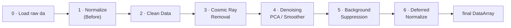

# SpectraLab — Data Flow & Operations Map

Where your data travels after upload, every operation it passes through, and exactly what is
cached vs. held in session state.

> **One invariant to remember:** `SpectralDataset.da` stays **raw forever**. Every stage returns a
> new `xr.DataArray`, and `get_finals` memoizes the whole chain per `(file_hash, pipeline_params)` —
> so the raw parse, the processed result, and the on-screen chart are three separate cache layers.

| Metric | Count |
|---|---|
| Workflow pages | 5 |
| Cache functions | 9 |
| Session-state keys | 11 |
| Pipeline stages | 7 |

---

## Interactive data-flow roadmap

```mermaid
flowchart LR
    upload([".wdf upload<br/><i>Sidebar file_uploader</i>"]):::source
    loadcache["_load_wdf_cached<br/><i>@st.cache_data</i>"]:::cache
    loadwdf["load_wdf()<br/><i>WDF parse → container</i>"]:::process
    dataset["SpectralDataset<br/><i>Typed xarray container</i>"]:::data
    sl_loaded[["sl_loaded<br/><i>session dict</i>"]]:::session
    data_page["Data Page + optics<br/><i>Sample structure / TMM</i>"]:::page
    sl_sample[["sl_sample_structure<br/><i>per-file optics</i>"]]:::session
    getfinals["get_finals / _preprocess_cached<br/><i>@st.cache_data</i>"]:::cache
    preprocess["preprocess()<br/><i>staged pipeline</i>"]:::process
    finals["final DataArray<br/><i>all_finals[fname]</i>"]:::data
    map["Map Analysis<br/><i>spatial heatmap</i>"]:::page
    nmf["Decomposition (NMF)<br/><i>Decomposer + diagnostic</i>"]:::page
    sl_nmf[["sl_nmf_result<br/><i>NMF components</i>"]]:::session
    deconv["Deconvolution<br/><i>PeakFitter (Gaussian)</i>"]:::page
    exports([Downloads<br/><i>NPZ / CSV buffers</i>]):::output

    upload --> loadcache --> loadwdf --> dataset --> sl_loaded
    sl_loaded --> data_page --> sl_sample
    sl_loaded --> getfinals
    sl_sample --> getfinals
    getfinals --> preprocess --> finals
    finals --> map
    finals --> nmf
    finals --> deconv
    nmf --> sl_nmf --> deconv
    map --> exports
    nmf --> exports
    deconv --> exports
    data_page --> exports

    classDef source fill:#e4e4e422,stroke:#888,color:#ccc;
    classDef cache fill:#f1b46722,stroke:#f1b467,color:#f1b467;
    classDef process fill:#3fa26622,stroke:#3fa266,color:#5fbf85;
    classDef data fill:#7bafe922,stroke:#7bafe9,color:#7bafe9;
    classDef session fill:#9386f222,stroke:#9386f2,color:#a99df5;
    classDef page fill:#81a1c122,stroke:#81a1c1,color:#9fb8d0;
    classDef output fill:#b48ead22,stroke:#b48ead,color:#c4a3bd;
```

**Legend:** `Input` · `Cache (@st.cache_data)` · `Backend compute` · `Data object` · `Session state` · `Page / operation` · `Download`

---

## Node reference

### `.wdf upload` — Input
`frontend/sidebar.py:31–81`
- User drops one or more Renishaw `.wdf` files (`accept_multiple_files=True`).
- Each file is read to raw bytes: `uf.read() → raw_bytes`.
- Widget key `file_uploader_{_sl_uploader_key}` — incremented on "Remove all files" to clear the uploader.

### `_load_wdf_cached` — Cache
`frontend/sidebar.py:14–16`
- **Stores:** `SpectralDataset` parsed from the file.
- **Cache key:** `raw_bytes` (full file content).
- **Invalidates:** file bytes change · LRU eviction past `max_entries=16`.
- Same bytes → instant cache hit, no re-parse. Re-uploading an identical file is free.

### `load_wdf()` — Backend compute
`backend/pipeline.py:29–121`
- Writes bytes to a temp `.wdf`, parses via `wdfkit.WDFReader`, deletes temp in `finally`.
- Extracts spectral axis, `laser_nm`, `laser_power`, `exposure_time`, scan image + EXIF geo.
- Runs `validate_spectral_dataset`, then builds the `SpectralDataset` dataclass.

### `SpectralDataset` — Data object
`backend/_shared/dataset.py:27–66`
- Holds the raw `xr.DataArray` (1D spectrum / 2D line-scan / 3D map) plus all metadata.
- `measurement_kind` → `"PL"` (Nanometer/eV) or `"Raman"` (RamanShift/Wavenumber).
- Design invariant: `.da` stays RAW forever — every stage returns a NEW DataArray.

### `sl_loaded` — Session state
`frontend/sidebar.py:109`
- **Stores:** `{fname: {bytes, hash=uf.file_id, dataset}}`.
- **Written by:** sidebar (rebuilt every rerun with files present).
- **Read by:** all 5 pages.
- **Reset when:** popped when uploader is emptied; overwritten each rerun.
- The single source of truth every page reads from (stores raw bytes AND the parsed dataset per file — RAM duplication).

### `Data Page + optics` — Page / operation
`frontend/pages/data_overview.py`
- Shows file metadata + white-light scan image with scan-footprint overlay.
- Sample Structure card runs `backend.optics`: `film_stack_summary` / `bare_substrate_summary`.
- Computes `c_physics = T_tmm/(1−R_air_sub)` ONCE here — the only page that calls optics.
- Exports full-spectra / mean-spectrum `.npz` downloads.

### `sl_sample_structure` — Session state
`frontend/pages/data_overview.py:208, 305–368`
- **Stores:** `{fname: {sample_type, film/substrate n·k·d, laser_nm, summary{c_physics}}}`.
- **Written by:** Data page (Sample Structure card).
- **Read by:** Preprocessing (bg physics scale, bg reference ordering).
- **Reset when:** popped on "Remove all files" only.
- Feeds the background-suppression physics scale — Preprocessing only CONSUMES `c_physics`, never recomputes it. Keyed by filename; widgets keyed by `file_id` (`ss_{file_id}_*`).

### `get_finals / _preprocess_cached` — Cache
`frontend/pipeline_cache.py:37–64`
- **Stores:** `(stages dict, final DataArray)` per file.
- **Cache key:** `file_hash` (`uf.file_id`) + full `pipeline_params` dict (`_dataset` excluded).
- **Invalidates:** `file_id` changes · ANY pipeline param changes · LRU past `max_entries=16`.
- The single integration point every analysis page routes through. Before Preprocessing is visited, uses `default_pipeline_params()` (all stages off).

### `preprocess()` — Backend compute
`backend/pipeline.py:136–252`
- Works on a local copy chain: `da = dataset.da`; the dataset itself is never mutated.
- `defer_norm` flag: when bg is ON, ALL normalization is deferred until after subtraction.
- Returns `(stages, da_final)`. `stages` is a sparse milestone map for the Progress tab.

### `final DataArray` — Data object
`backend/pipeline.py:252`
- The fully-processed spectra consumed by Map, Decomposition and Deconvolution.
- One per file; memoized by `(file_hash, pipeline_params)`.

### `Map Analysis` — Page / operation
`frontend/pages/map_analysis.py`
- 3D maps only. Integrated-intensity or deviation-from-mean over a spectral range slider.
- Plotly heatmap over the white-light image + ECharts mean spectrum with range band.
- Writes no results to session — widget keys only (`map_spec_range`, `map_quantity`, …).

### `Decomposition (NMF)` — Page / operation
`frontend/pages/decomposition.py`
- `backend.spectra_decomposer`: `compute_nmf_diagnostic_curve` (k-sweep) then `Decomposer.decompose`.
- PL maps only. Produces component spectra + per-component abundance maps.
- Exports NMF `.npz`.

### `sl_nmf_result` — Session state
`frontend/pages/decomposition.py:115–122`
- **Stores:** `{components, abundances, meta, spectral_coords, spectral_dim, file_name}`.
- **Written by:** Decomposition (Run NMF button).
- **Read by:** Decomposition · Deconvolution (as a fit target).
- **Reset when:** never auto-cleared — gated by matching `file_name`.
- Links Decomposition → Deconvolution: an NMF component can be a fit target. Survives page navigation and even upload changes.

### `Deconvolution` — Page / operation
`frontend/pages/deconvolution.py`
- `backend.peak_fitter`: `PeakFitter.fit` (mean / single pixel / NMF component) via lmfit Gaussians.
- `fit_map_gaussian` batch-fits every pixel (warm-started) — separate explicit button.
- Writes `sl_deconv_result` / `sl_deconv_batch_result`; exports CSV + `.npz`.

### `Downloads` — Output
`frontend/export_utils.py`
- In-memory buffers streamed to the browser — nothing is written server-side.
- `spectra_to_npz`, `mean_spectrum_to_npz`, `nmf_to_npz`, `fit_curves_to_npz`, `batch_fit_to_npz`.
- Full/mean NPZ downloads are themselves cached (`_full_npz_cached` / `_mean_npz_cached`).

---

## The preprocessing pipeline, in order

Runs inside `preprocess()`. Every stage is conditional — the **Enabled by** column shows the toggle
that enables it. When background suppression is on, all normalization is deferred to the end (stage 6).

| # | Stage | Enabled by | Location | Note |
|---|---|---|---|---|
| 0 | Load → raw `da` | always | `pipeline.py:145` | Working copy from `dataset.da`. Original never touched. |
| 1 | Normalize (Before) | `norm1 & !defer` | `pipeline.py:156–160` | `min_max` or `area` per spectrum. Skipped/deferred when bg is on. |
| 2 | Clean Data | `cd_enabled` | `pipeline.py:163–166` | Oversaturation check: ≥ `n_zeros` consecutive zeros → drop/NaN bad rows. |
| 3 | Cosmic Ray Removal | `crr` (PL only) | `pipeline.py:169–188` | Harmonic notch → 1D / collection / map engine by shape. Optional Norm 2. |
| 4 | Denoising | `denoise` (PL only) | `pipeline.py:191–222` | PCA population (default) OR per-spectrum Smoother (SavGol/Whittaker/Wavelet). Optional Norm 3. |
| 5 | Background Suppression | `bg_enabled` | `pipeline.py:225–241` | `corrected = measured − c·reference`, clipped ≥ 0. Always on un-normalized data. |
| 6 | Deferred Normalize | `defer & any norm` | `pipeline.py:243–250` | When bg was on, the chosen normalization runs here (post-suppression). |

---

## What gets cached, and on what key

All are `@st.cache_data` (LRU, no TTL) except `list_presets` (`@lru_cache`). Arguments prefixed with
`_` are excluded from the cache key. Zero `@st.cache_resource` in the app.

| Function | Location | Caches | Cache key | max |
|---|---|---|---|---:|
| `_load_wdf_cached` | `sidebar.py:14` | `SpectralDataset` | `raw_bytes` | 16 |
| `_preprocess_cached` | `pipeline_cache.py:37` | `(stages, final DataArray)` | `file_hash + pipeline_params` | 16 |
| `_draw_overlay_cached` | `data_overview.py:23` | Scan-overlay RGB array | `file_hash + image_meta` | 16 |
| `_full_npz_cached` | `data_overview.py:132` | Full-spectra `.npz` bytes | `file_hash + pipeline_params` | 16 |
| `_mean_npz_cached` | `data_overview.py:137` | Mean-spectrum `.npz` bytes | `file_hash + pipeline_params` | 16 |
| `_make_final_echarts_cached` | `preprocessing.py:575` | ECharts option dict | `hash + params + title/unit/…` | 16 |
| `_make_map_fig_cached` | `map_analysis.py:24` | Plotly map figure | `hash + params + range/quantity` | 16 |
| `_img_to_b64` | `map_chart.py:34` | Base64 PNG data URI | `arr` (numpy image) | 8 |
| `list_presets` (`lru_cache`) | `background/_presets.py:58` | Built-in `.npz` preset tuple | — (process lifetime) | 1 |

---

## What lives in session state

Keys prefixed `sl_` are app state (plus ~80 widget keys not listed). Note the asymmetry:
pipeline/analysis results mostly persist until **Remove all files** — swapping the upload set without
that button does not wipe them.

| Key | Written by | Read by | Stores | Reset when |
|---|---|---|---|---|
| `sl_loaded` | sidebar | All pages | `{fname:{bytes,hash,dataset}}` | Empty uploader |
| `sl_processing_ok` | sidebar | Preprocessing | PL + consistent kind → CRR/denoise ok | Empty uploader |
| `sl_pipeline_params` | Preprocessing | Data/Map/Decomp/Deconv | Full pipeline config dict | Remove all files |
| `sl_sample_structure` | Data page | Preprocessing bg scale | Per-file optics + `c_physics` | Remove all files |
| `sl_bg_ui` | Preprocessing | Preprocessing (restore) | BG widget snapshot | Remove all files |
| `sl_nmf_diagnostic` | Decomposition | Decomposition | k-sweep curve data | Never |
| `sl_nmf_result` | Decomposition | Decomp + Deconv | components/abundances/meta | Never (file_name gate) |
| `sl_deconv_result` | Deconvolution | Deconvolution | lmfit `FitResult` | Never (file gate) |
| `sl_deconv_batch_result` | Deconvolution | Deconvolution | Per-pixel `BatchFitResult` | Never (file gate) |
| `deconv_bands_table` | Deconvolution | Deconvolution | Editable band guesses | Never |
| `_sl_uploader_key` | sidebar | sidebar | `int` — uploader reset counter | n/a |

---

## Pages & the backend they drive

| Page | Operations | Backend | Writes |
|---|---|---|---|
| 1 · Data | Metadata, sample optics (TMM/Beer-Lambert), scan image, export | `optics` · `scan_overlay` | → `sl_sample_structure` |
| 2 · Preprocessing | Configure & preview the full pipeline | `pipeline.preprocess` | → `sl_pipeline_params`, `sl_bg_ui` |
| 3 · Map Analysis | Integrated / deviation spatial heatmaps | `get_finals` only | widget keys only |
| 4 · Decomposition | NMF patterns + abundance maps + k diagnostic | `spectra_decomposer` | → `sl_nmf_result` |
| 5 · Deconvolution | Multi-Gaussian peak fitting + batch map fit | `peak_fitter` | → `sl_deconv_*` |

Every analysis page (3–5) ultimately calls `get_finals → preprocess`. Optics runs only on the Data
page; its `c_physics` flows into background suppression on Preprocessing. NMF and peak-fitting are
page-local operations on the processed DataArray.
